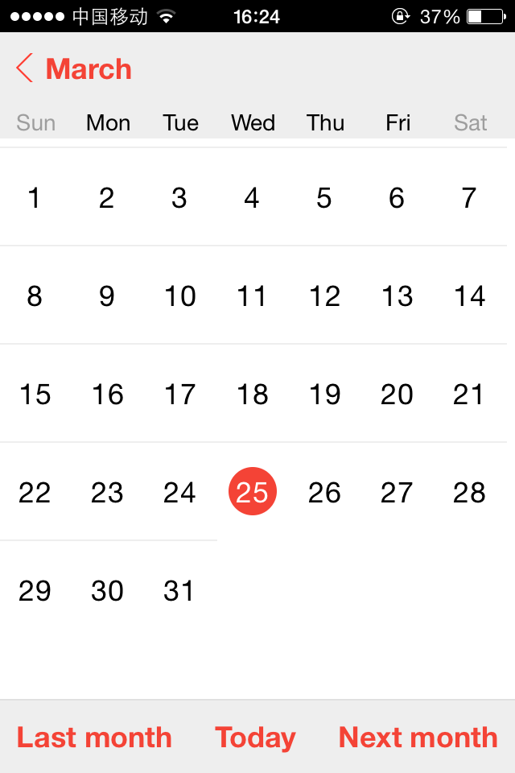
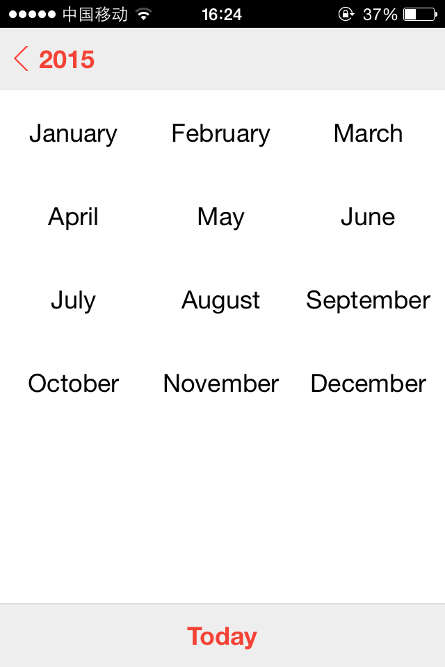
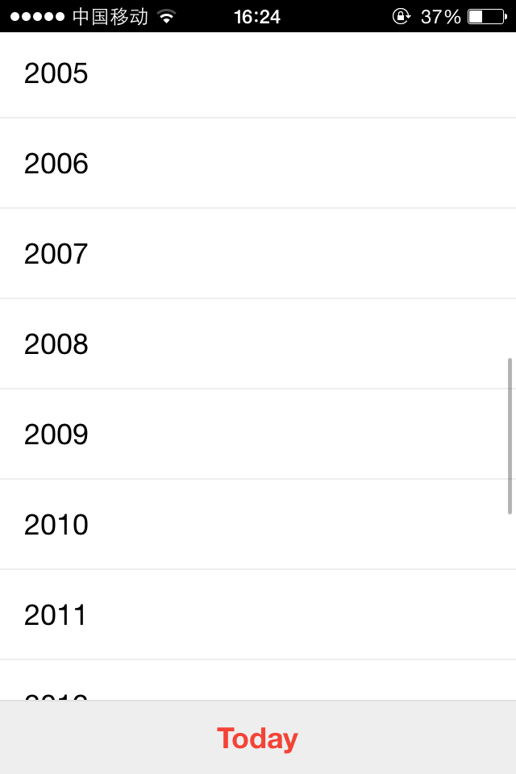

# Angular date picker

Exporting an angular module named: **datepicker**. It provides a directive **datepicker**. This directive will generate a calendar looks like the calendar app in iPhones.

## Main files

* build/angular-date-picker.js
* build/angular-date-picker.css
* build/img

## How to use

See the [sample](./test/index.html) in test folder.

* Include `angular-date-picker.css`
```html
<link rel="stylesheet" href="[path to css file]/angular-date-picker.css">
```
* Include `angular-date-picker.js`
```html
<script src="[path to js file]/angular-date-picker.js"></script>
```
* Your main app module require `datepicker` as a dependency
```js
angular.module('app', ['datepicker'])
```
* Use the exported datepicker directive
```html
<div datepicker="model.date" css-class="my-datepicker" current-date="2015-03-23T12:08:44.209Z"
    on-select-date="selectDate(date)"></div>
```

## Development

You will need to install `Nodejs` and `sass`(Ruby) first.

### Edit scss

```sh
$ npm install
$ bower install
$ gulp watch
```

## Build

```sh
$ npm install
$ gulp build
```

## Screenshots

  

## Author
Patrick Zhong ([@zhongsp](https://twitter.com/zhongsp))

## License
[MIT License](http://www.opensource.org/licenses/mit-license.php)
